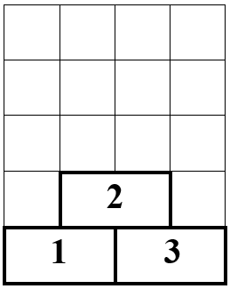

# H. Strategy tetris

**(Время: 2 сек. Память: 256 Мб. Ввод: стандартный ввод или `input.txt`. Вывод: стандартный вывод или `output.txt`)**

## Условие

Как и в обычном тетрисе, поле в игре Strategy Tetris представляет собой «стакан» шириной в $W$ клеток
($1 \le W \le 10^9$) и бесконечной высоты. В этот стакан падают сверху $N$ фигурок ($1 \le N \le 100000$). $i$-я фигурка
представляет собой прямоугольник шириной в $W_i$ клеток и высотой в одну клетку; самая левая клетка фигурки имеет
абсциссу $a_i$ ($1 \le a_i \le W - W_i + 1$). Фигурки падают по обычным правилам: если при падении фигурка хотя бы одной
своей клеткой ложится на какую-либо уже упавшую фигурку, то ее движение прекращается.

В отличие от обычного тетриса, игрок не имеет возможности вращать фигурки или смещать их по горизонтали в процессе
падения — еще бы, это пришлось бы делать быстро и не было бы времени серьёзно подумать над стратегией. Единственное, что
он может — это выбрать порядок, в котором эти $N$ фигурок упадут в стакан (каждая по одному разу). Ваша задача — помочь
ему выбрать такой порядок, при котором высота образовавшейся в результате падения конструкции была бы как можно меньше
(в отличие от обычного тетриса, полностью заполненная фигурками горизонталь никуда не исчезает).
На рисунке ниже приведен пример заполнения стакана фигурками из примера входных данных (порядок заполнения соответствует
выходному файлу, приведенному в примере).  


## Формат ввода

В первой строке входного файла записаны числа $N$ и $W$, а в последующих $N$ строках — пары чисел $a_i$ и $W_i$.

## Формат вывода

Выведите в выходной файл минимальную возможную высоту конструкции, а затем последовательность номеров фигурок, к этой
высоте приводящую. Фигурки нумеруются натуральными числами от 1 до $N$ в том порядке, в котором они указаны во входных
данных. Если возможных вариантов несколько, выведите любой из них.

## Пример

**Ввод**

```text
3 4
1 2
2 2
3 2
```

**Вывод**

```text
2
3 1 2
```
