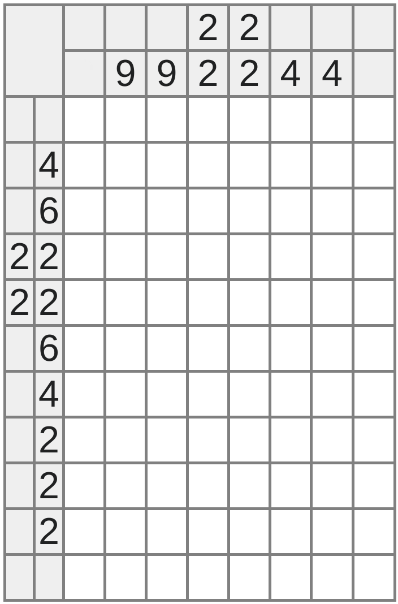
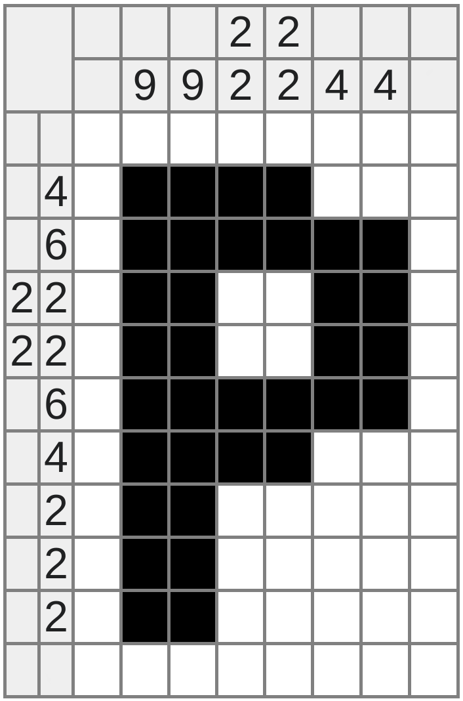

# 1. Японский кроссворд

**(Ограничение времени: 2 с. Ограничение памяти: 512.0 Мб)**

**Ввод:** стандартный ввод или `input.txt`  
**Вывод:** стандартный вывод или `output.txt`

Японский кроссворд — это головоломка, целью которой является получить черно-белую клетчатую картинку
размера $n \times m$. Загаданный японский кроссворд содержит пустое поле $n \times m$, некоторые клетки которого нужно
покрасить в черный цвет. Слева от каждой строки поля написана последовательность чисел. Эти числа соответствуют длинам
отрезков черных клеток в этой строке, перечисленным слева направо. Аналогично над каждым столбцом написана
последовательность чисел, соответствующих длинам черных отрезков в этом столбце, перечисленным сверху вниз.

Загаданный японский кроссворд:



Решенный японский кроссворд:



Для заданной картинки найдите последовательности чисел, которые должны быть написаны слева от строк и сверху от
столбцов.

## Формат ввода

В первой строке даны два целых числа $n$ и $m$ — размеры картинки ($1 \le n, m \le 100$).

В следующих $n$ строках дано по $m$ символов — описание картинки. Белый цвет обозначается символом «.», а черный — «#».

## Формат вывода

Сначала выведите $n$ строк, описывающих строки японского кроссворда сверху вниз. Каждая из них должна начинаться с
количества чисел в этой строке, а затем должны быть перечислены сами эти числа.

Далее выведите $m$ строк, описывающих столбцы японского кроссворда слева направо. Каждая из них должна начинаться с
количества чисел в этом столбце, а затем должны быть перечислены сами эти числа.

Для удобства, вы можете выводить дополнительные переводы строк.

### Пример

**INPUT.TXT**

```text
11 8
........
.####...
.######.
.##..##.
.##..##.
.######.
.####...
.##.....
.##.....
.##.....
........
```

**OUTPUT.TXT**

```text
0 
1 4 
1 6 
2 2 2 
2 2 2 
1 6 
1 4 
1 2 
1 2 
1 2 
0 

0 
1 9 
1 9 
2 2 2 
2 2 2 
1 4 
1 4 
0
```
