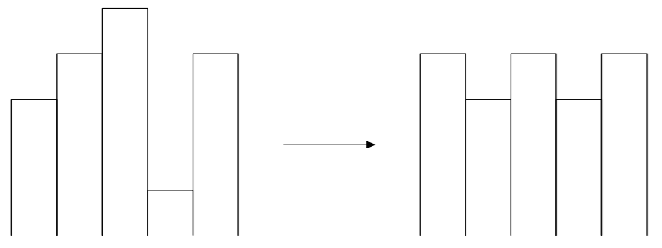

# 2. Изменение графика

**(Время: 2 сек. Память: 256 Мб. Ввод: стандартный ввод или `input.txt`. Вывод: стандартный вывод или `output.txt`)**

## Условие

График состоит из $n$ вертикальных столбиков, высота $i$-го столбика равна $a_i$. За одну операцию можно изменить высоту любого столбика на $1$ (обратите внимание, что высоты могут становиться отрицательными). Необходимо изменить высоты столбиков с $a_i$ на $b_i$ так, чтобы для любого $1 \le i \le n-2$ выполнялось $b_i = b_{i+2}$, а любые два соседних столбика отличались по высоте ровно на $k$.  


Определите минимальное количество операций для изменения графика.

## Формат ввода

В первой строке вводятся два целых числа $n$ и $k$ — количество столбиков, и высота, на которую должны отличаться два соседних столбика ($2 \le n \le 10^5$, $0 \le k \le 10^9$).

Во второй строке вводится $n$ целых чисел $a_i$ — исходные высоты столбиков ($-10^9 \le a_i \le 10^9$).

## Формат вывода

В единственной строке выведите минимальное число операций для изменения графика.

## Пример

**Ввод**

```text
5 1
1 2 3 -1 2
```

**Вывод**

```text
5
```

## Примечание

В первом примере можно получить следующую последовательность $b_i$: $2$, $1$, $2$, $1$, $2$.
