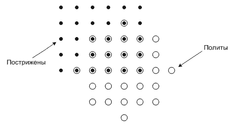

# E. Газон
|  |  |
|--|--|
|Ограничение времени | 1 секунда |
|Ограничение памяти | 256Mb|
|Ввод | стандартный ввод или input.txt|
|Вывод | стандартный вывод или output.txt|

Фермер Иван с юности следит за своим газоном. Газон можно считать плоскостью, на которой в каждой точке с целыми координатами растет один пучок травы.

В одно из воскресений Иван воспользовался газонокосилкой и постриг некоторый прямоугольный участок газона. Стороны этого участка параллельны осям координат, а две противоположные вершины расположены в точках (x1, y1) и (x2, y2). Следует отметить, что пучки травы, находящиеся на границе этого прямоугольника, также были пострижены.

Довольный результатом Иван купил и установил на газоне дождевальную установку. Она была размещена в точке с координатами (x3, y3) и имела радиус действия струи r. Таким образом, установка начала поливать все пучки, расстояние от которых до точки (x3, y3) не превышало r.

Все было хорошо, но Ивана заинтересовал следующий вопрос: сколько пучков травы оказалось и пострижено, и полито в это воскресенье?

Требуется написать программу, которая позволит дать ответ на вопрос Ивана.

### Формат ввода

В первой строке входного файла содержатся четыре целых числа x1, y1, x2, y2 (−100 000 ≤ x1 < x2 ≤ 100 000; −100 000 ≤ y1 < y2 ≤ 100 000).

Во второй строке входного файла содержатся три целых числа x3, y3, r (−100 000 ≤ x3, y3 ≤ 100 000; 1 ≤ r ≤ 100 000)

### Формат вывода

В выходной файл необходимо вывести одно целое число — число пучков травы, которые были и пострижены, и политы. 

## Пример 1
## Ввод	
0 0 5 4
4 0 3

## Вывод
14

## Примечания
Пример 

