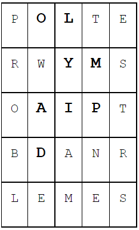

# B. Головоломка
|  |  |
|--|--|
|Ограничение времени | 1 секунда |
|Ограничение памяти | 256Mb|
|Ввод | стандартный ввод или input.txt|
|Вывод | стандартный вывод или output.txt|

Петя разгадывает головоломку, которая устроена следующим образом. Дана квадратная таблица размера NxN, в каждой клетке которой записана какая-нибудь латинская буква. Кроме того, дан список ключевых слов. Пете нужно, взяв очередное ключевое слово, найти его в таблице. То есть найти в таблице все буквы этого слова, причем они должны быть расположены так, чтобы клетка, в которой расположена каждая последующая буква слова, была соседней с клеткой, в которой записана предыдущая буква (клетки называются соседними, если они имеют общую сторону — то есть соседствуют по вертикали или по горизонтали). Например, на рисунке ниже показано, как может быть расположено в таблице слово olympiad.

Когда Петя находит слово, он вычеркивает его из таблицы. Использовать уже вычеркнутые буквы в других ключевых словах нельзя.

После того, как найдены и вычеркнуты все ключевые слова, в таблице остаются еще несколько букв, из которых Петя должен составить слово, зашифрованное в головоломке.

Помогите Пете в решении этой головоломки, написав программу, которая по данной таблице и списку ключевых слов выпишет, из каких букв Петя должен сложить слово, то есть какие буквы останутся в таблице после вычеркивания ключевых слов.

### Формат ввода

В первой строке входного файла записаны два числа N (1 ≤ N ≤ 10) и M (0 ≤ M ≤ 200). Следующие N строк по N заглавных латинских букв описывают ребус. Следующие M строк содержат слова. Слова состоят только из заглавных латинских букв, каждое слово не длиннее 200 символов. Гарантируется, что в таблице можно найти и вычеркнуть по описанным выше правилам все ключевые слова.

### Формат вывода

В единственную строку выходного файла выведите в любом порядке буквы, которые останутся в таблице.

## Пример 1
## Ввод	
5 3
POLTE
RWYMS
OAIPT
BDANR
LEMES
OLYMPIAD
PROBLEM
TEST

## Вывод
AENRSW
