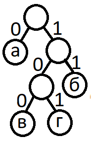

# E. Дерево Хаффмана

|                     |                                  |
| ------------------- | -------------------------------- |
| Ограничение времени | 1 секунда                        |
| Ограничение памяти  | 64Mb                             |
| Ввод                | стандартный ввод или input.txt   |
| Вывод               | стандартный вывод или output.txt |

Алгоритм Хаффмана позволяет кодировать символы алфавита беспрефиксным кодом различной длины, сопоставляя частым символам более короткий код, а редким - более длинный. Этот алгоритм используется во многих программах сжатия данных. Код символа определяется по следующим правилам:

1. Символы входного алфавита образуют список свободных узлов. Каждый лист имеет вес, который может быть равен либо вероятности, либо количеству вхождений символа в сжимаемое сообщение.

2. Выбираются два свободных узла дерева с наименьшими весами.

3. Создается их родитель с весом, равным их суммарному весу.

4. Родитель добавляется в список свободных узлов, а два его потомка удаляются из этого списка.

5. Правой дуге, выходящей из родителя, ставится в соответствие бит 1, левой - бит 0. Битовые значения ветвей, исходящих от корня, не зависят от весов потомков.

6. Шаги, начиная со второго, повторяются до тех пор, пока в списке свободных узлов не останется только один свободный узел. Он и будет считаться корнем дерева.

Пусть буквы "а" встречается в сообщении 4 раза, буква "б" - 3 раза, а буквы "в" и "г" - по 1 разу. Этим частотам может быть сопоставлено такое дерево:

Двоичный код буквы - это все цифры на пути из корня дерева в лист, соответствующей этой букве.

Для эффективного сжатия также важно максимально экономно хранить дерево Хаффмана. Опишем обход в глубину этого дерева, при этом мы будем сначала полностью обходить левое поддерево, затем возвращаться в узел, а затем обходить правое поддерево. Каждый раз проходя по ребру будем записывать букву L, R или U в зависимости от того, куда мы шли по ребру (L - в левого ребенка, R- в правого ребенка, U - в родителя). Приведенному в примере дереву будет соответствовать строка:

LURLLURUURUU

Такая строка позволяет однозначно восстановить дерево и сопоставить двоичные коды всем листьям дерева. Однако, запись можно модифицировать, заменив ребра типа L и R на ребра типа D, которое означает, что мы спускаемся в ребенка (сначала в левого, а если левый посещен - в правого). Тогда запись для нашего дерева будет выглядеть так:

DUDDDUDUUDUU

По этой строке также однозначно возможно восстановить структуру дерева. Она использует алфавит только из двух символов вместо трёх и может быть закодирована меньшим числом бит.

Эту запись также можно модифицировать, заменив смысл команды U. Теперь U будет обозначать, что мы поднимаемся к предку текущей вершины до тех пор, пока мы правый ребёнок. Если при подъёме мы пришли в вершину из левого ребенка, то сразу перейдем в правого. Запись для нашего дерева будет выглядеть так:

DUDDUU

Вам необходимо по записи, построенной по таким правилам, определить коды для всех листьев в порядке их обхода.

## Формат ввода

В первой строке входного файла задается число N (1 ≤ N ≤ 100) - количество строк. Каждая из следующих N строк содержит описание обхода дерева.

Суммарное количество символов в описаниях не превосходит 100000.

## Формат вывода

В качестве ответа необходимо вывести N блоков кодов для каждой из строк входного файла. Каждый блок состоит из числа листьев K в этом дереве и из K строк, содержащих цифры 0 и 1 и описывающих код каждого из листьев.

Гарантируется, что размер вывода не превосходит 2Мб..

## Пример 1
## Ввод	
2  
DUDDUU  
DU  
## Вывод
4  
0  
100  
101  
11  
2  
0  
1  