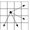

# 32. Ход конём - 2

|                   |                                |
|-------------------|--------------------------------|
|Ограничение времени|1 секунда                       |
|Ограничение памяти |64Mb                            |
|Ввод               |стандартный ввод или input.txt  |
|Вывод              |стандартный вывод или output.txt|

Дана прямоугольная доска $N × M$ ($N$ строк и $M$ столбцов). В левом верхнем углу находится шахматный конь, которого необходимо переместить в правый нижний угол доски.

При этом конь может ходить следующим образом:



Необходимо определить, сколько существует различных маршрутов, ведущих из левого верхнего в правый нижний угол.

## Формат ввода

Входной файл содержит два натуральных числа $N$ и $M$ ($1≤ N,1≤M$).

## Формат вывода

В выходной файл выведите единственное число — количество способов добраться конём до правого нижнего угла доски.

### Пример 1

***Ввод***

```text
4 4
```

***Вывод***

```text
2
```

### Пример 2

***Ввод***

```text
2 3
```

***Вывод***

```text
1
```
