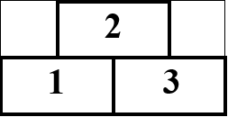

# B. Эффективный менеджмент

В компании принята следующая практика: новая задача поручается последнему нанятому сотрудинку. Задача номер i
характеризуется временем начала ai и временем Ti, которое требуется для ее выполнения. Сотрудник может работать
одновременно только над одной задачей. Закончив выполнять задачу, сотрудник сразу же может приступить к выполнению
другой задачи. Если последний нанятый сотрудник не может выполнить задачу из-за пересечения с уже порученными, то
компания нанимает нового сотрудника и поручает задачу ему.

Эффективный Менеджер выделил N задач на следующий период продолжительностью W. Задачи могут поручаться в любом порядке.
Помогите Эффективному Менеджеру переупорядочить поручение задач таким образом, чтобы количество нанятых сотрудников было
минимально.

На рисунке ниже приведен пример выполнения трех задач двумя сотрудниками (рисунок соответствует примеру).  

## Формат ввода

В первой строке входного файла записаны числа N (1 ≤ N ≤ 100000) и W (1 ≤ W ≤ $10^9$).

В следующих N строках записаны пары чисел ai и Ti (1 ≤ ai ≤ W – Ti + 1).

## Формат вывода

Выведите минимальное количество сотрудников, которые будут наняты компанией.

Затем выведите переупорядоченную последовательность поручения задач, приводящую к найму наименьшего количества
сотрудников. Задачи нумеруются натуральными числами от 1 до N в том порядке, в котором они указаны во входных данных.
Если возможных вариантов несколько, выведите любой из них.

## Пример 1

### Ввод

    3 4
    1 2
    2 2
    3 2

### Вывод

    2
    3 1 2