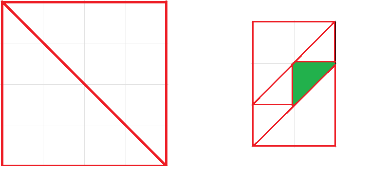

# E. Упаковка эчпочмаков

**(Время: 3 секунды. Память: 512 Мб. Ввод: стандартный ввод или `input.txt`. Вывод: стандартный вывод или
`output.txt`)**

## Условие

Андрей работает мыловаром и живет в общежитии со своим соседом Азатом. Бабушка прислала Азату коробку своих фирменных
эчпочмаков. Эчпочмаки пахли так вкусно, что Андрей не выдержал и съел некоторые из них.

Коробка с эчпочмаками — это прямоугольник размером $N \times M$. Фирменные эчпочмаки бабушки Азата представляют собой
непересекающиеся равнобедренные треугольники, вершины которых имеют целые координаты (начало координат в левом нижнем
углу коробки). Хотя бы одна сторона каждого эчпочмака параллельна стороне коробки.

Андрей решил оставить уцелевшие эчпочмаки на своих местах, а взамен съеденных приготовить новые и расположить их так,
чтобы никакие два эчпочмака не пересекались и в коробке не осталось свободного места. Приготовленные Андреем эчпочмаки
также должны быть равнобедренными треугольниками, их вершины должны иметь целочисленные координаты и хотя бы одна из
сторон должна быть параллельна стороне коробки.

Определите минимальное количество эчпочмаков, которые должен приготовить Андрей и координаты, в которых их необходимо
разместить. Если правильных ответов несколько — выведите любой из них.

## Формат ввода

В первой строке вводится три целых числа $N$, $M$ и $K$ ($1 \le N, M \le 4$, $0 \le K \le 32$) — размеры коробки и
количество уцелевших эчпочмаков бабушки Азата.

Следующие $K$ строк содержат по 6 координат $(x_1, y_1)$, $(x_2, y_2)$, $(x_3, y_3)$
($0 \le x_i \le N$, $0 \le y_i \le M$).

## Формат вывода

Выведите число $\Theta$ — минимальное количество эчпочмаков, которые должен приготовить Андрей.

В следующих $\Theta$ строках выведите по 6 чисел — координаты эчпочмаков в том же формате, как во входных данных.

Если правильных ответов несколько — выведите любой из них.

## Примеры

### Пример 1

**Ввод**

```text
4 4 0
```

**Вывод**

```text
2
0 0 0 4 4 0 
0 4 4 0 4 4 
```

### Пример 2

**Ввод**

```text
2 3 1
1 1 2 2 1 2
```

**Вывод**

```text
5
0 0 2 0 2 2 
0 1 0 3 2 3 
0 1 1 1 1 2 
0 0 0 1 1 1 
1 2 2 2 2 3 
```

## Примечание

Рисунки соответствуют примерам. Эчпочмаки от бабушки покрашены в зеленый, а приготовленные Андреем имеют красный контур.
