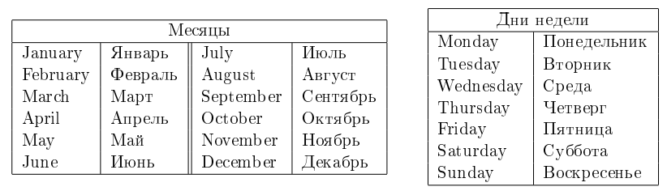
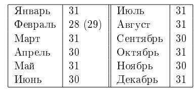

# I. Расписание

Как же Илье надоело учиться! Сначала школа, потом университет... Вот, наконец, наступил тот долгожданный день, когда Илье утром не надо ехать на учебу. Но, к несчастью для Ильи, оказалось, что после окончания университета начинается самое трудное — надо устраиваться на работу.

Во всемирно известной фирме «Goondex», в которую устроился Илья, принято очень много работать, в частности, для сотрудников установлена шестидневная рабочая неделя. Но, в качестве бонуса, «Goondex» каждый год предлагает своим сотрудникам выбрать любой день недели в качестве выходного. В свою очередь, оставшиеся шесть дней недели будут рабочими.

Илья сообразил, что с учётом государственных праздников (которые всегда являются выходными) с помощью правильного выбора выходного дня недели можно варьировать количество рабочих дней в году. Теперь он хочет знать, какой день недели ему следует выбрать в качестве выходного, чтобы отдыхать как можно больше дней в году, или, наоборот, демонстрировать чудеса трудолюбия, работая по максимуму. 

## Input  
В первой строке входных данных находится одно целое число **N** (0&nbsp;≤N&nbsp;≤&nbsp;366) — количество государственных
праздников.

Во второй строке содержится одно целое число year (1800 ≤ year ≤ 2100) — год, в который необходимо помочь Илье.

В каждой из последующих N строк расположено по паре чисел day month
(day — целое число, month — слово, между day и month ровно один пробел),
обозначающих, что день day месяца month является государственным праздником.

В последней строке расположено слово — день недели первого января в год year.

Гарантируется, что все даты указаны корректно
(в том числе указанный день недели первого января
действительно является днём недели первого января соответствующегогода year)
и все дни государственных праздников различны.
 

## Output
Выведите через пробел два дня недели — лучший и худший варианты дней недели для выходного
(то есть дни недели, для которых достигается соответственно максимальное
и минимальное количество выходных дней в году).
Если возможных вариантов ответа несколько, выведите любой из них. 


## Example1
<font color="blue">**Ввод:**</font> 
```c++
2
2015
1 January
8 January
Thursday
```
<font color="blue">**Вывод:**</font>
```c++
Monday Thursday
```  

## Example2
<font color="blue">**Ввод:**</font>
```c++
3
2013
1 January
8 January
15 January
Tuesday
```
<font color="blue">**Вывод:**</font>
```c++
Monday Tuesday
```  

## Example3
<font color="blue">**Ввод:**</font>
```c++
3
2013
6 February
13 February
20 February
Tuesday
```
<font color="blue">**Вывод:**</font>
```c++
Tuesday Wednesday
```  

### Примечания

Рассмотрим подробно третий пример.

2013 год начинается и заканчивается во вторник (Tuesday),
при этом на вторник приходится 53 дня года, а на все остальные дни недели –— по 52 дня.  
Все три государственных праздника выпадают на среду (Wednesday).  
Если Илья выберет в качестве выходного дня вторник, то в году у него будет 53 + 3 = 56 выходных дней
(53 вторника и 3 государственных праздника).  
Если Илья выберет в качестве выходного дня среду, то у него будет только 52 выходных дня.   
Если же Илья выберет в качестве выходного дня любой другой день недели, то у него будет 52 + 3 = 55 выходных дней.

Таким образом, лучший вариант для выходного дня — вторник, худший — среда,
и единственным правильным ответом в данном примере является Tuesday Wednesday.

Соответствие названий месяцев и дней недели в английском и русском языках:
 

Соответствие названий месяцев и количества дней в них:


В феврале 29 дней только в високосные года.  
Год является високосным, если он кратен 400, либо кратен 4 и не кратен 100. Например, 1996 и 2000 являются високосными, а 1999 и 1900 — нет.