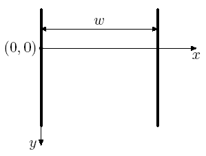
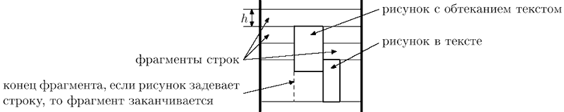

# J. Форматирование документа  

Вася пишет новую версию своего офисного пакета "Closed Office". Недавно он начал работу над редактором "Dword", входящим в состав пакета.

Последняя проблема, с которой столкнулся Вася — размещение рисунков в документе. Он никак не может добиться стабильного отображения рисунков в тех местах, в которые он их помещает. Окончательно отчаявшись написать соответствующий модуль самостоятельно, Вася решил обратиться за помощью к вам. Напишите программу, которая будет осуществлять размещение документа на странице.

Документ в формате редактора "Dword" представляет собой последовательность абзацев. Каждый абзац представляет собой последовательность элементов – слов и рисунков. Элементы одного абзаца разделены пробелами и/или переводом строки. Абзацы разделены пустой строкой. Строка, состоящая только из пробелов, считается пустой.

Слово — это последовательность символов, состоящая из букв латинского алфавита, цифр, и знаков препинания: ".", ",", ":", ";", "!", "?", "-", "'".  
Рисунок описывается следующим образом: "(**image** image parameters)". Каждый параметр рисунка имеет вид "имя=значение". Параметры рисунка разделены пробелами и/или переводом строки. У каждого рисунка обязательно есть следующие параметры:

width — целое положительное число, ширина рисунка в пикселях height — целое положительное число, высота рисунка в пикселях layout — одно из следующих значений: embedded (в тексте), surrounded (обтекание текстом), floating (свободное), описывает расположение рисунка относительно текста

Документ размещается на бесконечной вверх и вниз странице шириной w пикселей (разбиение на конечные по высоте страницы планируется в следующей версии редактора). Одна из точек на левой границе страницы условно считается точкой с ординатой равной нулю. Ордината увеличивается вниз.

Размещение документа происходит следующим образом. Абзацы размещаются по очереди. Первый абзац размещается так, что его верхняя граница имеет ординату 0.  

  

Абзац размещается следующим образом. Элементы располагаются по строкам. Каждая строка исходно имеет высоту h пикселей. В процессе размещения рисунков высота строк может увеличиваться, и строки могут разбиваться рисунками на фрагменты.  



Слова размещаются следующим образом. Считается, что каждый символ имеет ширину c пикселей. Перед каждым словом, кроме первого во фрагменте, ставится пробел шириной также в c пикселей. Если слово помещается в текущем фрагменте, то оно размещается на нем. Если слово не помещается в текущем фрагменте, то оно размещается в первом фрагменте текущей строки, расположенном правее текущего, в котором оно помещается. Если такого фрагмента нет, то начинается новая строка, и поиск подходящего фрагмента продолжается в ней. Слово всегда "прижимается" к верхней границе строки.

Размещение рисунка зависит от его расположения относительно текста.

Если расположение рисунка относительно текста установлено в "embedded", то он располагается так же, как слово, за тем исключением, что его ширина равна ширине, указанной в параметрах рисунка. Кроме того, если высота рисунка больше текущей высоты строки, то она увеличивается до высоты рисунка (при этом верхняя граница строки не перемещается, а смещается вниз нижняя граница). Если рисунок типа "embedded" не первый элемент во фрагменте, то перед ним ставится пробел шириной c пикселей. Рисунки типа "embedded" также прижимаются к верхней границе строки.

Если расположение рисунка относительно текста установлено в "surrounded", то рисунок размещается следующим образом. Сначала аналогично находится первый фрагмент, в котором рисунок помещается по ширине. При этом перед рисунком этого типа не ставится пробел, даже если это не первый элемент во фрагменте.
После этого рисунок размещается следующим образом: верхний край рисунка совпадает с верхней границей строки, в которой находится найденный фрагмент, а сам рисунок продолжается вниз. При этом строки, через которые он проходит, разбиваются им на фрагменты.

Если расположение рисунка относительно текста установлено в "floating", то рисунок размещается поверх текста и других рисунков и никак с ними не взаимодействует. В этом случае у рисунка есть два дополнительных параметра: "dx" и "dy" — целые числа, задающие смещение в пикселях верхнего левого угла рисунка вправо и вниз, соответственно, относительно позиции, где находится верхний правый угол предыдущего слова или рисунка (или самой левой верхней точки первой строки абзаца, если рисунок — первый элемент абзаца).

Если при размещении рисунка таким образом он выходит за левую границу страницы, то он смещается вправо, так, чтобы его левый край совпадал с левой границей страницы. Аналогично, если рисунок выходит за правую границу страницы, то он смещается влево, чтобы его правый край совпадал с правой границей страницы.

Верхняя граница следующего абзаца совпадает с более низкой точкой из нижней границы последней строки и самой нижней границы рисунков типа "surrounded" предыдущего абзаца.

По заданным w, h, c и документу найдите координаты верхних левых углов всех рисунков в документе.

## Формат ввода
Первая строка входного файла содержит три целых числа: w, h и c (1 &le; w &le; 1000, 1 &le; h &le; 50, 1 &le; c &le; w).

Далее следует документ. Размер входного файла не превышает 1000 байт. Гарантируется, что ширина любого слова и любого рисунка не превышает w. Высота всех рисунков не превышает 1000. Относительное смещение всех рисунков типа «floating» не превышает 1000 по абсолютной величине.  

## Формат вывода  
Выведите в выходной файл по два числа для каждого рисунка — координаты его верхнего левого угла. Выводите координаты рисунков в том порядке, в котором они встречаются во входном файле.  

## <span style ="color:blue">**Пример 1**</span>  
**Ввод**  
```
120 10 8
start (image layout=embedded width=12 height=5)
(image layout=surrounded width=25 height=58)
and word is 
(image layout=floating dx=18 dy=-15 width=25 height=20)
here new 
(image layout=embedded width=20 height=22)
another
(image layout=embedded width=40 height=19)
longword

new paragraph
(image layout=surrounded width=5 height=30)
(image layout=floating width=20 height=35 dx=50 dy=-16)
```  
**Вывод**  
```
48 0
60 0
74 -5
32 20
0 52
104 81
100 65
```  

## <span style ="color:blue">**Пример 2**</span>  
**Ввод**  
```
1000 2 3
```  
**Вывод**  
```
```  

## <span style ="color:blue">**Пример 3**</span>  
**Ввод**  
```
100 2 3
(image dx=10 dy=11 height=100 width=20 layout=floating)
```  
**Вывод**  
```
10 11
```  