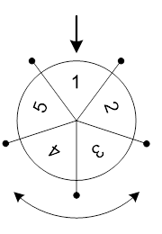

# F. Колесо Фортуны

Развлекательный телеканал транслирует шоу «Колесо Фортуны». В процессе игры участники шоу крутят большое колесо, разделенное на сектора. В каждом секторе этого колеса записано число. После того как колесо останавливается, специальная стрелка указывает на один из секторов. Число в этом секторе определяет выигрыш игрока.

Юный участник шоу заметил, что колесо в процессе вращения замедляется из-за того, что стрелка задевает за выступы на колесе, находящиеся между секторами. Если колесо вращается с угловой скоростью v градусов в секунду, и стрелка, переходя из сектора X к следующему сектору, задевает за очередной выступ, то текущая угловая скорость движения колеса уменьшается на k градусов в секунду. При этом если v ≤ k, то колесо не может преодолеть препятствие и останавливается. Стрелка в этом случае будет указывать на сектор X. 

<p align="center">
  
</p>

Юный участник шоу собирается вращать колесо. Зная порядок секторов на колесе, он хочет заставить колесо вращаться с такой начальной скоростью, чтобы после остановки колеса стрелка указала на как можно большее число. Колесо можно вращать в любом направлении и придавать ему начальную угловую скорость от a до b градусов в секунду.

Требуется написать программу, которая по заданному расположению чисел в секторах, минимальной и максимальной начальной угловой скорости вращения колеса и величине замедления колеса при переходе через границу секторов вычисляет максимальный выигрыш.  

## Input  

Первая строка входного файла содержит целое число n — количество секторов колеса (3 &le; n &le; 100).

Вторая строка входного файла содержит n положительных целых чисел, каждое из которых не превышает 1000 — числа, записанные в секторах колеса. Числа приведены в порядке следования секторов по часовой стрелке. Изначально стрелка указывает на первое число.

Третья строка содержит три целых числа: a, b и k (1 &le; a &le; b &le; 109, 1 &le; k &le; 10<sup>9</sup>).

## Output
В выходном файле должно содержаться одно целое число — максимальный выигрыш.

## Example1
<font color="blue">**Ввод:**</font>
```c++
5
1 2 3 4 5
3 5 2
```
<font color="blue">**Вывод:**</font>
```c++
5 
``` 

## Example2
<font color="blue">**Ввод:**</font>
```c++
5
1 2 3 4 5
15 15 2
```
<font color="blue">**Вывод:**</font>
```c++
4
``` 

## Example3
<font color="blue">**Ввод:**</font>
```c++
5
5 4 3 2 1
2 5 2
```
<font color="blue">**Вывод:**</font>
```c++
5
``` 

### **Примечания**

В первом примере возможны следующие варианты: можно придать начальную скорость колесу равную 3 или 4, что приведет к тому, что стрелка преодолеет одну границу между секторами, или придать начальную скорость равную 5, что позволит стрелке преодолеть 2 границы между секторами. В первом варианте, если закрутить колесо в одну сторону, то выигрыш получится равным 2, а если закрутить его в противоположную сторону, то — 5. Во втором варианте, если закрутить колесо в одну сторону, то выигрыш будет равным 3, а если в другую сторону, то — 4.

Во втором примере возможна только одна начальная скорость вращения колеса — 15 градусов в секунду. В этом случае при вращении колеса стрелка преодолеет семь границ между секторами. Тогда если его закрутить в одном направлении, то выигрыш составит 4, а если в противоположном направлении, то — 3.

Наконец, в третьем примере оптимальная начальная скорость вращения колеса равна 2 градусам в секунду. В этом случае стрелка вообще не сможет преодолеть границу между секторами, и выигрыш будет равен 5.