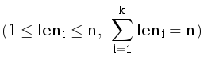

# F. G. Ни больше ни меньше

Дан массив целых положительных чисел a длины n. Разбейте его на **минимально возможное** количество отрезков, чтобы каждое число было не меньше длины отрезка которому оно принадлежит. Длиной отрезка считается количество чисел в нем.

Разбиение массива на отрезки считается корректным, если каждый элемент принадлежит ровно одному отрезку.  

## Input  
Первая строка содержит одно целое число t (1 &le; t &le; 1000) — количество наборов тестовых данных. Затем следуют t наборов тестовых данных.

Первая строка набора тестовых данных содержит одно целое число n (1 &le; n &le; 105) — длину массива.

Следующая строка содержит n целых чисел a<sub>1</sub>, a<sub>2</sub>, &hellip;, a<sub>n</sub> (1 &le; ai &le; n) — массив a.

Гарантируется, что сумма n по всем наборам тестовых данных не превосходит 2 &times; 10<sup>5</sup>.  

## Output
Для каждого набора тестовых данных в первой строке выведите число k — количество отрезков в вашем разбиении.

Затем в следующей строке выведите k чисел _len<sub>1</sub>, len<sub>2</sub>, &hellip;, len<sub>k</sub>_  
    — длины отрезков в порядке слева направо.

## Example1
<font color="blue">**Ввод:**</font>
```c++
3
5
1 3 3 3 2
16
1 9 8 7 6 7 8 9 9 9 9 9 9 9 9 9
7
7 2 3 4 3 2 7
```
<font color="blue">**Вывод:**</font>
```c++
3
1 2 2
3
1 6 9 
3
2 3 2 
``` 


### **Примечания**

Ответы в примере соответствуют разбиениям:

{[1], [3, 3], [3, 2]}

{[1], [9, 8, 7, 6, 7, 8], [9, 9, 9, 9, 9, 9, 9, 9, 9]}

{[7, 2], [3, 4, 3], [2, 7]}

В первом наборе тестовых данных набор длин {1, 3, 1}, соответствующий разбиению {[1], [3, 3, 3], [2]}, также был бы корректным.