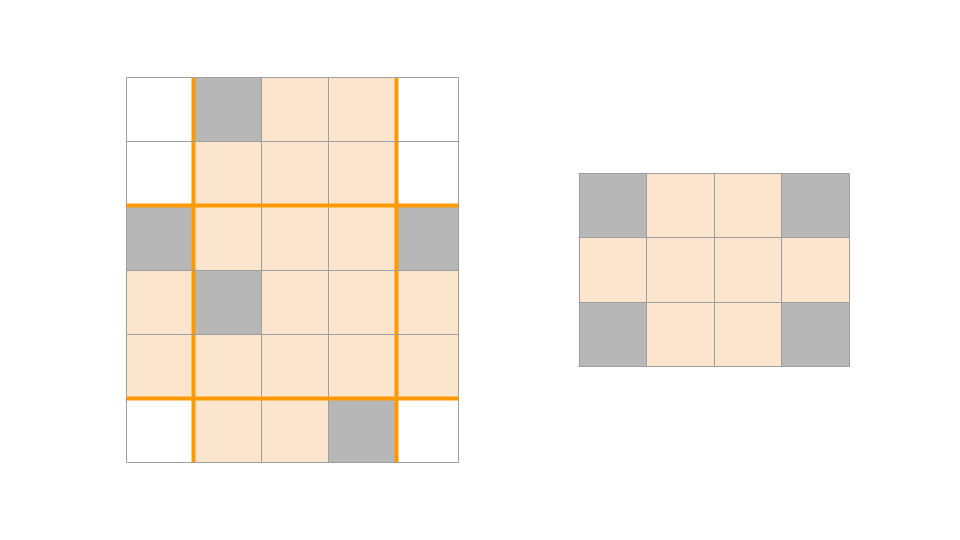

# F. Велодорожки

Мэр одного города очень любит следить за тенденциями и воспроизводить их в своём городе. До него дошла новость о популярности велодорожек. Теперь он хочет проложить велодорожки в своём городе и сделать это лучше, чем в других городах! Поэтому он решил сделать велодорожки даже на главной площади города.
Главная площадь представляет собой прямоугольник шириной w и высотой h , замощённый квадратными плитками со стороной 1. Мэр хочет, чтобы было проложено две велодорожки одинаковой ширины: одна горизонтальная и одна вертикальная. К сожалению, ремонт на площади проводился достаточно давно и на некоторых плитках уже появились трещины. Мэр хочет проложить велодорожки так, чтобы после этого на площади остались только целые плитки. При строительстве велодорожек плитки на их месте убираются. Можно только убирать плитки с площади и нельзя менять местами или добавлять новые. Чтобы потратить меньше денег, мэр хочет сделать велодорожки наименьшей возможной ширины, при этом ширина дорожек должна быть целым числом. Определите, какой должна быть ширина велодорожек.  

## Формат ввода
В первой строке входных данных содержатся три целых числа w, h, n (1 &le; w, h &le; 10<sup>9</sup>, 1 &le; n &le; min(w &times; h, 3&times;10<sup>5</sup> ))— ширина и высота площади и количество потрескавшихся плиток соответственно.
В следующих n строках содержится по 2 целых числа x<sub>i</sub>, y<sub>i</sub> (1 &le; x<sub>i</sub> &le; w, 1 &le; y<sub>i</sub> &le; h)— координаты потрескавшихся плиток.
(x<sub>i</sub>, y<sub>i</sub>) &ne; (x<sub>j</sub>, y<sub>j</sub>) при i &ne;j.

## Формат вывода
Выведите единственное число c (1 &le; c &le; min(w,h))  — наименьшую возможную ширину велодорожек.  

## Example1
<font color="blue">**Input:**</font>
```c++
5 6 5
5 4
2 6
4 1
2 3
1 4
```
<font color="blue">**Output:**</font>
```c++
3
``` 

## Example2
<font color="blue">**Input:**</font>
```c++
4 3 4
1 1
4 3
4 1
1 3
```
<font color="blue">**Output:**</font>
```c++
3
``` 

## Примечания

Ниже приведены картинки к примерам из условия. Серым отмечены потрескавшиеся плитки. Во втором примере ширина дорожек равна меньшей из сторон прямоугольника.  
 