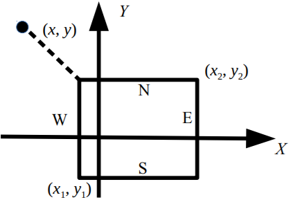

# A. Плот


Посередине озера плавает плот, имеющий форму прямоугольника. Стороны плота направлены вдоль параллелей и меридианов.  
Введём систему координат, в которой ось OX направлена на восток, а ось ОY – на север.  
Пусть юго-западный угол плота имеет координаты (x<sub>1</sub>, y<sub>1</sub>), северо-восточный угол – координаты (x<sub>2</sub>, y<sub>2</sub>).

Пловец находится в точке с координатами (x, y). Определите, к какой стороне плота (северной, южной, западной или восточной) или к какому углу плота (северо-западному, северо-восточному, юго-западному, юго-восточному) пловцу нужно плыть, чтобы как можно скорее добраться до плота.  
  

## Формат ввода

Программа получает на вход шесть чисел в следующем порядке:x<sub>1</sub>, y<sub>1</sub> (координаты юго-западного угла плота),
x<sub>2</sub>, y<sub>2</sub> (координаты северо-восточного угла плота), x, y (координаты пловца). Все числа целые и по модулю не превосходят 100.  
Гарантируется, что x<sub>1</sub> &lt; x<sub>2</sub>, y<sub>1</sub> &lt; y<sub>2</sub>, x<sub>1</sub> &ne; x<sub>2</sub>, x<sub>1</sub> &ne; x, x<sub>2</sub> &ne; x, y<sub>1</sub> &ne; y, y<sub>2</sub> &ne; y.  

## Формат вывода

Если пловцу следует плыть к северной стороне плота, программа должна вывести символ ”N”, к южной — символ ”S”, к западной — символ ”W”, к восточной — символ ”E”. Если пловцу следует плыть к углу плота, нужно вывести одну из следующих строк: ”NW”, ”NE”, ”SW”, ”SE”.  

## Пример

**Ввод**  
```c++
-1
-2
5
3
-4
6
```

**Вывод**  
```c++
NW
```

