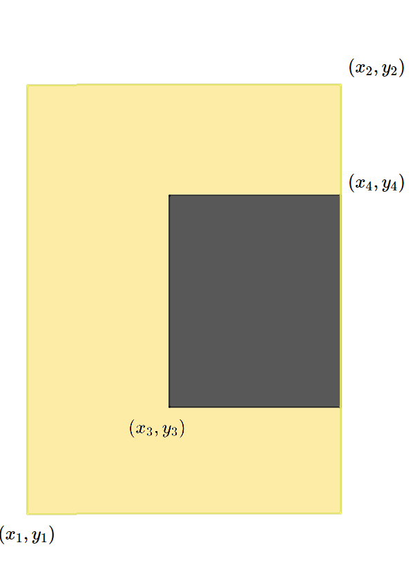
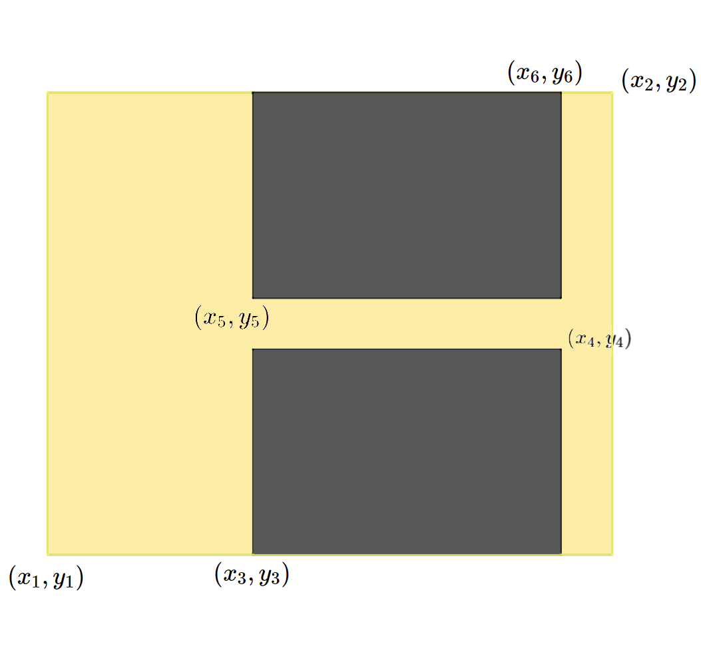
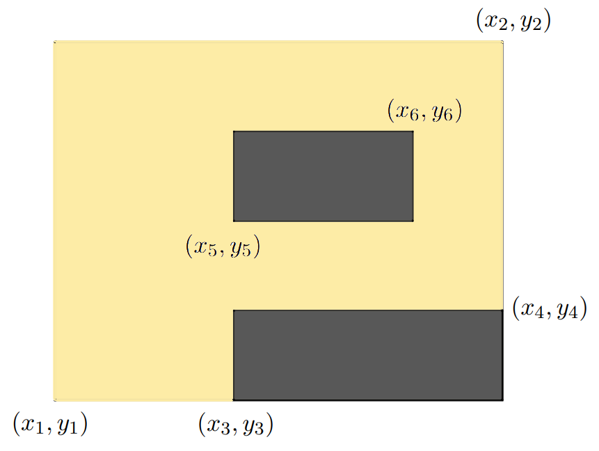

# C. Надпись на табло

Вы получили доступ к одной из камер наблюдения в особо секретной организации. В зоне видимости камеры находится табло,  
с которого вы постоянно считываете информацию. Теперь вам нужно написать программу, которая по состоянию табло определяет,  
какая буква изображена на нём в данный момент. Табло представляет собой квадратную таблицу, разбитую на n × n равных  
квадратных светодиодов. Каждый диод либо включён, либо выключен. Введём систему координат, направив ось OX вправо, а ось  
OY — вверх, приняв сторону диода равной 1.
На табло могут быть изображены только следующие буквы:  
*  **I** — прямоугольник из горящих диодов.  
*  **O** — прямоугольник из горящих диодов с углами (x1, y1) и (x2, y2), внутри которого есть прямоугольник из выключенных диодов  
 с координатами углов (x3, y3) и (x4, y4). При этом границы выключенного прямоугольника не должны касаться внешнего,  
 то есть x1 < x3 < x4 < x2 и y1 < y3 < y4 < y2.  
*  **C** — прямоугольник из горящих диодов с углами (x1, y1) и (x2, y2), внутри которого есть прямоугольник из выключенных диодов   
 с координатами углов (x3, y3) и (x4, y4). При этом правая граница выключенного прямоугольника находится на правой границе  
внешнего прямоугольника, то есть x1 < x3 < x4 = x2 и y1 < y3 < y4 < y2.  

*  **L** — прямоугольник из горящих диодов с углами (x1, y1) и (x2, y2), внутри которого есть прямоугольник из выключенных диодов   
с координатами углов (x3, y3) и (x4, y4). При этом правые верхние углы выключенного прямоугольника и внешнего прямоугольника   
 совпадают, то есть x1 < x3 < x4 = x2 и y1 < y3 < y4 = y2.  
*  **H** — прямоугольник из горящих диодов с углами (x1, y1) и (x2, y2), внутри которого находятся 2 прямоугольника из   
 выключенных диодов с координатами углов (x3, y3), (x4, y4) у первого и (x5, y5), (x6, y6) у второго.  
 При этом выключенные прямоугольники должны иметь одинаковую ширину, находиться строго один под другим, один прямоугольник  
 должен касаться верхней стороны, а другой прямоугольник должен касаться нижней стороны внешнего прямоугольника,  
 то есть x1 < x3 = x5 < x4 = x6 < x2 и y1 = y3 < y4 < y5 < y6 = y2.  
 
*  **P** — прямоугольник из горящих диодов с углами (x1, y1) и (x2, y2), внутри которого находятся 2 прямоугольника из  
 выключенных диодов с координатами углов (x3, y3), (x4, y4) у первого и (x5, y5), (x6, y6) у второго. При этом правый   
 нижний угол первого выключенного прямоугольника должен совпадать с правым нижним углом внешнего прямоугольника,   
 а другой выключенный прямоугольник должен находиться строго выше и не касаться границ других прямоугольников,   
 также левые границы двух выключенных прямоугольников должны совпадать, 
 то есть x1 < x3 = x5 < x6 < x4 = x2 и y1 = y3 < y4 < y5 < y6 < y2.  

* Любое другое состояние табло считается буквой **X**.  

По виду табло определите, какая буква на нём изображена.

## Входные данные

В первой строке входных данных находится одно число n (1 ≤ n ≤ 10) — сторона табло.
В следующих n строках находятся строки длины n из символов «.» и «#» — строки таблицы.
«.» обозначает выключенный квадратный диод табло, а «#» — горящий.  

## Выходные данные

Программа должна вывести единственный символ: если данная таблица подходит под одно из описаний букв I, O, C, L, H, P,  
то выведите её (все буквы — английские). Если же данная таблица не подходит ни под какие условия, то выведите X.

## Примеры 
**Ввод**
```c++
4
.##.
.##.
.##.
....
```  
**Вывод**  
```c++
I
```

**Ввод**
```c++
5
#...#
.#.#.
..#..
.#.#.
#...#
```  
**Вывод**
```c++
X
```