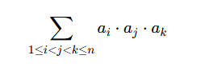

# F. Сумма тройных произведений

Задана последовательность из n чисел a<sub>i</sub>. Найдите число    
  
Поскольку число может получиться слишком большим, требуется посчитать его по модулю 1 000 000 007. 

## Формат ввода

В первой строке дано одно целое число n (3 &le; n &le; 10<sup>6</sup>).
Во второй строке даны n целых чисел a<sub>i</sub> (0 &le; a<sub>i</sub> &le; 10<sup>6</sup>).  

## Формат вывода

Выведите требуемое число по модулю 1 000 000 007.

## Пример 1

**Ввод**  
```c++
3
1 2 3
```
**Вывод**  
```c++
6
```

## Пример 2

**Ввод**
```c++
4
0 5 6 7
```
**Вывод**
```c++
210
```
