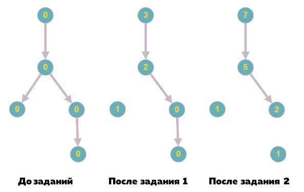
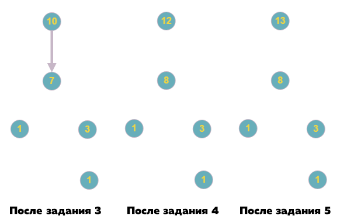

# F. Бюрократия

Мирко стал генеральным директором крупной корпорации. В компании работает N человек, пронумерованных от 1 до N . Мирко
имеет номер 1 . У всех кроме Мирко есть начальник. Начальник может иметь несколько подчинённых, но не более одного
непосредственного начальника.

Когда Мирко получает задание от инвесторов, он передаёт его своему подчинённому с наименьшим номером. Этот подчинённый
также передаёт его своему подчинённому с наименьшим номером, и так далее, пока задание не перейдёт несчастливому
работнику без подчинённых, который должен сделать задание.

Этот работник получает 1 монету, его начальник получает 2 монеты, начальник этого начальника получает 3 и так далее.
Потом тот, кто на самом деле сделал работу, осознаёт, насколько эта капиталистическая система несправедлива и
увольняется с работы.

Мирко получает задания до тех пор, пока в корпорации не останется всего один сотрудник — сам Мирко. Тогда он выполняет
это задание, получает 1 монету и уходит из корпорации. Ему стало интересно, сколько всего монет получил каждый бывший
сотрудник. Помогите ему с этим.

## Формат ввода

Первая строка содержит одно натуральное число N (1 &le; N ≤ &le; 2 &dot; 10<sup>5</sup>) — число сотрудников компании.
Следующая строка содержит N -1 чисел a<sub>2</sub>, a<sub>3</sub>, &hellip;, a<sub>N</sub>( 1 &lt; a<sub>i</sub> &lt;
i), где a<sub>i</sub> — номер
начальника i-го сотрудника.

## Формат вывода

Выведите N чисел, i-е число должно означать, сколько монет получил i-й сотрудник.

## Пример 1

### Ввод

```c++
3
1 1
```

### Вывод

```c++
5 1 1
```

## Пример 2

### Ввод

```c++
5
1 2 2 4
```

### Вывод

```c++
13 8 1 3 1
```

## Примечания

Пояснения к первому примеру:
  
Пояснения ко второму примеру:

 