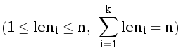

# B. Ни больше ни меньше

Дан массив целых положительных чисел _a_ длины _n_. Разбейте его на минимально возможное количество отрезков, чтобы
каждое число было не меньше длины отрезка которому оно принадлежит. Длиной отрезка считается количество чисел в нем.

Разбиение массива на отрезки считается корректным, если каждый элемент принадлежит ровно одному отрезку.

## Формат ввода

Первая строка содержит одно целое число _t (1 ≤ t ≤ 1 000)_ — количество наборов тестовых данных. Затем следуют _t_
наборов тестовых данных.

Первая строка набора тестовых данных содержит одно целое число _n (1 ≤ n ≤ 105)_ — длину массива.

Следующая строка содержит _n_ целых чисел _a1, a2, …, an (1 ≤ ai ≤ n)_ —
массив _a_.

Гарантируется, что сумма n по всем наборам тестовых данных не превосходит 2 ⋅ 105.

## Формат вывода

Для каждого набора тестовых данных в первой строке выведите число _k_ — количество отрезков в вашем разбиении.

Затем в следующей строке выведите _k_ чисел _len1, len2, …, lenk_  

— длины отрезков в порядке слева направо.

## Пример 1

### Ввод

    3
    5
    1 3 3 3 2
    16
    1 9 8 7 6 7 8 9 9 9 9 9 9 9 9 9
    7
    7 2 3 4 3 2 7

### Вывод

    3
    1 2 2
    3
    1 6 9 
    3
    2 3 2 

## Примечания

Ответы в примере соответствуют разбиениям:

_{[1], [3, 3], [3, 2]}_

_{[1], [9, 8, 7, 6, 7, 8], [9, 9, 9, 9, 9, 9, 9, 9, 9]}_

_{[7, 2], [3, 4, 3], [2, 7]}_

В первом наборе тестовых данных набор длин _{1, 3, 1}_, соответствующий разбиению _{[1], [3, 3, 3], [2]}_, также был бы
корректным.