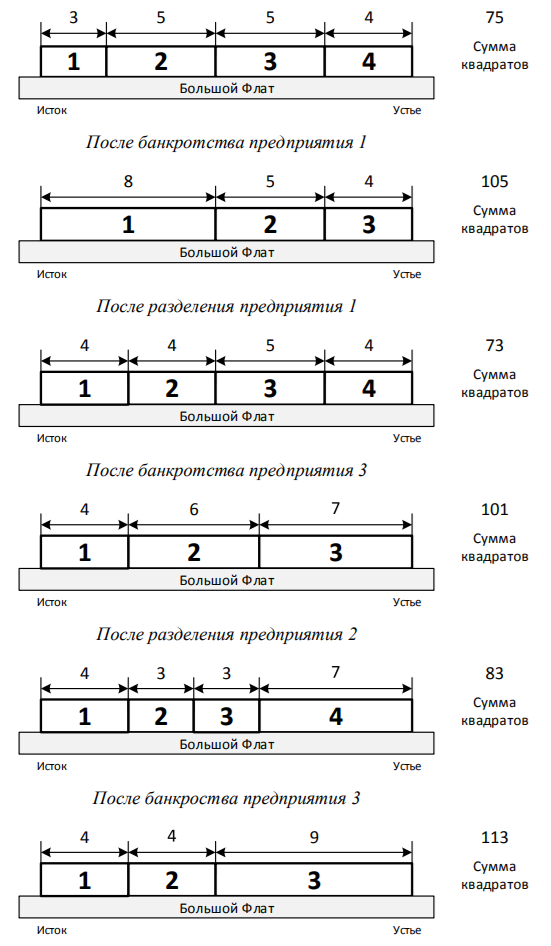

# J. Простая река

Во Флатландии протекает богатая рыбой река Большой Флат. Много лет назад река была поделена между _n_ рыболовными
предприятиями, каждое из которых получило непрерывный отрезок реки. При этом _i_ -е предприятие, если рассматривать их
по порядку, начиная от истока, изначально получило отрезок реки длиной _ai_.

С тех пор с рыболовными предприятиями во Флатландии _k_ раз происходили различные события. Каждое из событий было одного
из двух типов: банкротство некоторого предприятия или разделение некоторого предприятия на два.

При некоторых событиях отрезок реки, принадлежащий предприятию, с которым это событие происходит, делится на две части.
Каждый такой отрезок имеет длину большую или равную 2. Деление происходит по следующему правилу. Если отрезок имеет
чётную длину, то он делится на две равные части. Иначе он делится на две части, длины которых различаются ровно на
единицу, при этом часть, которая ближе к истоку реки, имеет меньшую длину.

При банкротстве предприятия происходит следующее. Отрезок реки, принадлежавший обанкротившемуся предприятию, переходит к
его соседям. Если у обанкротившегося предприятия один сосед, то этому соседу целиком передается отрезок реки
обанкротившегося предприятия. Если же соседей двое, то отрезок реки делится на две части описанным выше способом, после
чего каждый из соседей присоединяет к своему отрезку ближайшую к нему часть.

При разделении предприятия отрезок реки, принадлежавший разделяемому предприятию, всегда делится на две части описанным
выше способом. Разделившееся предприятие ликвидируется, и образуются два новых предприятия. Таким образом, после каждого
события каждое предприятие владеет некоторым отрезком реки.

Министерство финансов Флатландии предлагает ввести налог на рыболовные предприятия, пропорциональный квадрату длины
отрезка реки, принадлежащего соответствующему предприятию. Чтобы проанализировать, как будет работать этот налог,
министр хочет по имеющимся данным узнать, как изменялась величина, равная сумме квадратов длин отрезков реки,
принадлежащих предприятиям, после каждого произошедшего события.

Требуется написать программу, которая по заданному начальному разделению реки между предприятиями и списку событий,
происходивших с предприятиями, определит, чему равна сумма квадратов длин отрезков реки, принадлежащих предприятиям, в
начальный момент времени и после каждого события.

## Формат ввода

Первая строка ввода содержит число _n_ — исходное количество предприятий _(2 ≤ n ≤ 100000)_.

Вторая строка входного файла содержит _n_ целых чисел _a1, a2, ..., an_ — длины
исходных отрезков реки.

Третья строка входного файла содержит целое число _k_ — количество событий, происходивших с предприятиями (1 ≤ k ≤
100000).

Последующие _k_ строк содержат описания событий, _i_-я строка содержит два целых числа: _ei_ и _v
i_ — тип события и номер предприятия, с которым оно произошло. Значение _ei = 1_ означает, что
предприятие, которое после всех предыдущих событий является _vi_ -м по порядку, если считать с единицы от
истока реки, обанкротилось, а значение _ei = 2_ означает, что это предприятие разделилось на два.

Гарантируется, что значение _vi_ не превышает текущее количество предприятий. Гарантируется, что если отрезок
предприятия при банкротстве или разделении требуется поделить на две части, то он имеет длину большую или равную 2.
Гарантируется, что если на реке осталось единственное предприятие, оно не банкротится.

**В случае, если** _n > 100_ **гарантируется, что для всех** _i_ **от** _1_ **до** _k−1_ **выполнено условие**: _∣v
i − vi+1∣ ≤ 10_

## Формат вывода

Вывод должен содержать _k+1_ целое число, по одному в строке. Первая строка должна содержать исходную сумму квадратов
длин отрезков реки, а каждая из последующих _k_ строк — сумму квадратов длин отрезков реки после очередного события.

## Пример 1

### Ввод

    4
    3 5 5 4
    5
    1 1
    2 1
    1 3
    2 2
    1 3

### Вывод

    75
    105
    73
    101
    83
    113

## Примечания

Пояснение к примеру:  
