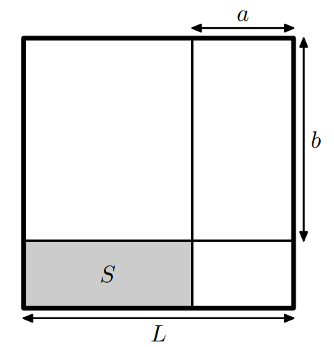

# A. Полка раздора

Вася решил сделать из квадратного куска фанеры прямоугольную полочку для дома.

Для этого он взял на работе кусок фанеры и отпилил и выбросил от него полосу шириной a, сделав вертикальный разрез.

После этого он отрезал полосу высотой b сделав горизонтальный разрез, и также выбросил её.

Площадь оставшейся полочки была равна S.

После этого у Васи начались неприятности. Во-первых, начальник заметил исчезновение листа фанеры и обязал Васю купить за
свой счет точно такой же лист. Во-вторых, жена выбросила полочку, так что измерить её Вася не может и всё что он
помнит — это числа a, b и S.

В магазине продаются только квадратные листы фанеры с целочисленными сторонами. Помогите Васе, определите размеры листа,
который он использовал, либо определите, что такого не существует.

### Формат ввода

Вводятся три целых числа a, b и S (0 <= a, b <= 10<sup>4</sup>, S <= 10 <sup>8</sup>).

### Формат вывода

Если необходимый лист фанеры есть в продаже, то выведите длину его стороны L.

Если же такого листа с целочисленными сторонами не может существовать, то выведите «-1».

### Пример 1

**Ввод:**

```
1 1 1
```

**Вывод:**  
`2`

### Пример 2

**Ввод:**

```
2 3 12
```

**Вывод:**  
`6`

### Пример 3

**Ввод:**

```
1 1 2
```

**Вывод:**  
`-1`