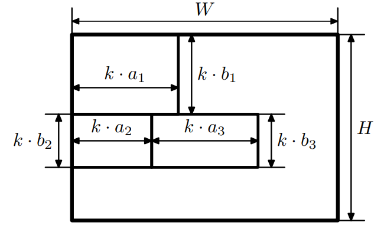

# C. Рекламное объявление

Ивану с детства нравились газеты. У него даже была мечта стать главным редактором газеты. Однажды ему представился шанс
осуществить свою мечту. Чтобы устроиться на работу в издательство, ему необходимо выполнить тестовое задание — сверстать
рекламное объявление.

Задано поле шириной W и высотой H. Объявление должно состоять из одной или нескольких строк, в которых необходимо
разместить в заданном порядке N слов. Про i-е слово известно, что при печати в стандартном масштабе оно занимает
прямоугольник шириной a<sub>i</sub>  и высотой b<sub>i</sub>.

Чтобы объявление выглядело красиво, все слова в нем должны быть напечатаны в одном масштабе. При печати в масштабе k
размеры всех слов умножаются на k. Если исходно слово занимало прямоугольник a<sub>i</sub> * b<sub>i</sub>, то при
печати в масштабе k оно занимает прямоугольник размером (k * a<sub>i</sub>) * ( k * b<sub>i</sub>). Кроме того, если в
строке более одного слова, то все слова в ней должны иметь одинаковую высоту. Разумеется, ни одно слово не должно
выходить за границы поля.

На рисунке приведен пример красивого объявления с тремя словами.

Помогите Ивану найти максимальный масштаб, при котором можно сверстать объявление, которое удовлетворяет этим критериям.
Обратите внимание, что менять порядок слов нельзя, они должны читаться по строкам сверху вниз, слева направо в том
порядке, в котором заданы.

### Формат ввода

В первой строке входного файла дано три числа: N, W и H ( 1≤N≤100000, 1≤W,H≤10<sup>9</sup>) — число слов в объявлении,
длина и высота объявления. В следующих N строках дано по два целых числа, в i-й из них заданы a<sub>i</sub>, b<sub>
i</sub>(1<= a<sub>i</sub>, b<sub>i</sub> <= 10<sup>9</sup>) — ширина и высота i-го слова.

### Формат вывода

Выведите одно вещественное число k — максимальный масштаб. Ответ требуется вывести с относительной погрешностью не более
10<sup>-6</sup>.

### Пример 1

**Ввод:**

```
3 10 7
4 3
3 2
4 2
```

**Вывод:**  
`1.400000000000199973`

### Пример 2

**Ввод:**

```
2 10 1
2 1
3 2
```

**Вывод:**  
`0.333333333333666715`

