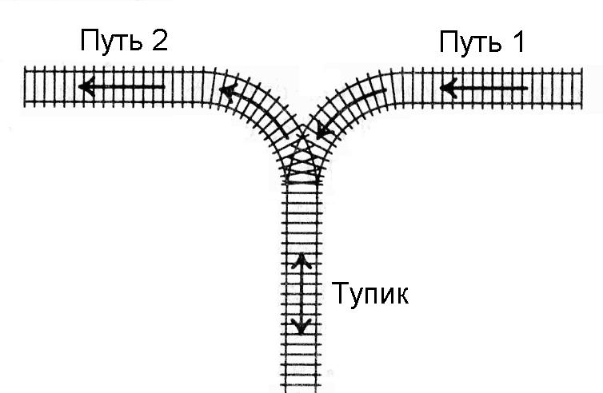

# B. Сортировка вагонов lite

<table>
  <tr>
    <td>Ограничение времени</td>
    <td>1 секунда</td>
  </tr>
  <tr>
    <td>Ограничение памяти</td>
    <td>64Mb</td>
  </tr>
  <tr>
    <td>Ввод</td>
    <td>стандартный ввод или input.txt</td>
  </tr>
  <tr>
    <td>Вывод</td>
    <td>стандартный вывод или output.txt</td>
  </tr>
</table>

К тупику со стороны пути 1 (см. рисунок) подъехал поезд. Разрешается отцепить от поезда один или сразу несколько первых вагонов и завезти их в тупик (при желании, можно даже завезти в тупик сразу весь поезд). После этого часть из этих вагонов вывезти в сторону пути 2. После этого можно завезти в тупик еще несколько вагонов и снова часть оказавшихся вагонов вывезти в сторону пути 2. И так далее (так, что каждый вагон может лишь один раз заехать с пути 1 в тупик, а затем один раз выехать из тупика на путь 2). Заезжать в тупик с пути 2 или выезжать из тупика на путь 1 запрещается. Нельзя с пути 1 попасть на путь 2, не заезжая в тупик.

<p style="text-align:center;"></p>

Известно, в каком порядке изначально идут вагоны поезда. Требуется с помощью указанных операций сделать так, чтобы вагоны поезда шли по порядку (сначала первый, потом второй и т.д., считая от головы поезда, едущего по пути 2 в сторону от тупика). Напишите программу, определяющую, можно ли это сделать.

## Формат ввода

Вводится число N — количество вагонов в поезде (1 ≤ N ≤ 100). Дальше идут номера вагонов в порядке от головы поезда, едущего по пути 1 в сторону тупика. Вагоны пронумерованы натуральными числами от 1 до N, каждое из которых встречается ровно один раз.

## Формат вывода

Если сделать так, чтобы вагоны шли в порядке от 1 до N, считая от головы поезда, когда поезд поедет по пути 2 из тупика, можно, выведите сообщение YES, если это сделать нельзя, выведите NO.

### Пример 1

#### Ввод

```
3
3 2 1
```

#### Вывод

```
YES
```

### Пример 2

#### Ввод

```
4
4 1 3 2
```

#### Вывод

```
YES
```

### Пример 3

#### Ввод

```
3
2 3 1
```

#### Вывод

```
NO
```